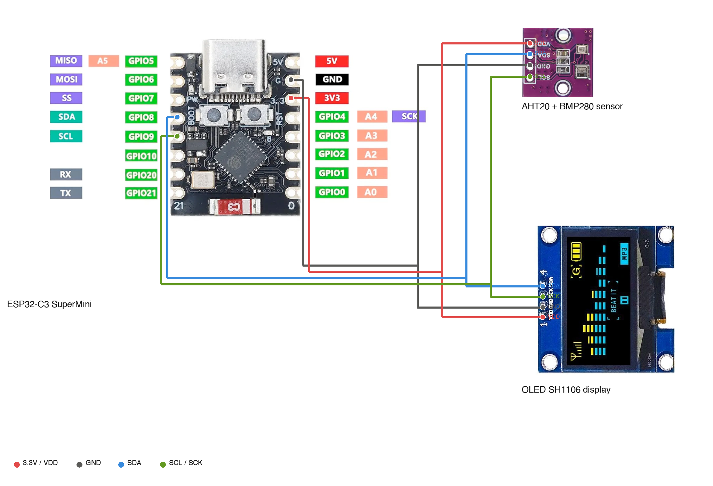

# ElTech-Online ESP32-C3 Weather Station

Firmware for a small beginner-friendly weather station built from an **ESP32-C3 SuperMini**, an **AHT20+BMP280** combo sensor (temperature/humidity/pressure), and a **1.3" OLED SH1106** display — the same firmware that ships pre-flashed on every [ElTech-Online](https://www.ebay.co.uk/usr/eltech-online) weather station kit.


## What it does

- Reads temperature, humidity (AHT20) and barometric pressure (BMP280) over I2C
- Shows a boot splash (shop logo + name) for 2 seconds, then a live readout: a large centered temperature as the headline reading, with humidity and pressure as smaller stats underneath
- Mirrors every reading to Serial (115200 baud) each cycle
- Prints a self-test line on boot (`OLED: OK/NOT FOUND`, `AHT20: OK/NOT FOUND`, `BMP280: OK/NOT FOUND`) — this is the actual bench-test procedure used before dispatch, and it doubles as your first confirmation that everything is wired correctly

There are **two sketches** in this repo:

| Sketch | What it adds |
|---|---|
| `weather_station/` | The basic version above — OLED + Serial only. |
| `weather_station_ap/` | Same sensor/OLED behaviour, **plus** the board starts its own WiFi network (an Access Point — no router needed) and serves a live-updating webpage with the readings. Connect any phone or laptop to the network it creates and browse to the address it shows on the OLED. |

## Hardware

| Component | Notes |
|---|---|
| ESP32-C3 SuperMini (or any ESP32-C3 dev board) | Needs WiFi support for the `weather_station_ap` sketch's Access Point + web dashboard |
| AHT20+BMP280 combo sensor | I2C, address `0x38` (AHT20) / `0x77` (BMP280) — confirm yours with the included scanner, some modules ship at `0x76` |
| 1.3" OLED, SH1106 driver, 128×64, I2C | Address `0x3C` (try `0x3D` if blank) |
| Breadboard + jumper wires | Both sensor and display share one I2C bus — 4 wires to each (VCC, GND, SDA, SCL) |

## Wiring

All three devices share one I2C bus — wire SDA together and SCL together (this is normal for I2C, each device has its own address):

| Signal | ESP32-C3 | AHT20+BMP280 | OLED |
|---|---|---|---|
| 3.3V | 3V3 | VCC | VCC |
| GND | GND | GND | GND |
| SDA | GPIO 8 | SDA | SDA |
| SCL | GPIO 9 | SCL | SCL |

**Pin numbers vary between SuperMini clone boards.** If your board doesn't respond on GPIO 8/9, use `i2c_scanner/i2c_scanner.ino` first — it sweeps several candidate pin pairs and reports which one finds your devices.

> **Note:** GPIO 8/9 above are the ESP32-C3 SuperMini's own labeled I2C pins (see the wiring diagram). The firmware in this repo (`I2C_SDA`/`I2C_SCL` in both sketches) is **not updated yet** — it still has the values confirmed on the earlier ESP32-C6 build. It'll be updated to match once the C3 boards arrive and are bench-tested; until then, adjust `I2C_SDA`/`I2C_SCL` in the sketch to 8/9 yourself if you're wiring against this README.



## Setup (Arduino IDE)

1. **Add the ESP32 board index**: `File > Preferences` → Additional Boards Manager URLs:
   ```
   https://raw.githubusercontent.com/espressif/arduino-esp32/gh-pages/package_esp32_index.json
   ```
2. **Install the board package**: `Tools > Board > Boards Manager`, search "esp32", install **esp32 by Espressif Systems**.
3. **Select the board**: `Tools > Board > esp32 > ESP32C3 Dev Module`.
4. **Tools menu settings** below are carried over from this project's earlier ESP32-**C6** build and not yet re-confirmed on real C3 hardware — treat as a starting point, not a guarantee, until re-tested:

   | Setting | Value |
   |---|---|
   | Board | ESP32C3 Dev Module |
   | USB CDC On Boot | Enabled |
   | CPU Frequency | 160MHz |
   | Core Debug Level | None |
   | Erase All Flash Before Sketch Upload | Disabled |
   | Flash Frequency | 80MHz |
   | Flash Mode | QIO |
   | Flash Size | 4MB (32Mb) |
   | JTAG Adapter | Disabled |
   | Partition Scheme | Default 4MB with spiffs (1.2MB APP/1.5MB SPIFFS) |
   | Upload Speed | 921600 |

   (Port will be whatever your OS assigns the board — e.g. `/dev/cu.usbmodem*` on macOS, `COM*` on Windows.)
5. **Install libraries** via `Sketch > Include Library > Manage Libraries`:
   - Adafruit AHTX0
   - Adafruit BMP280 Library
   - Adafruit SH110X
   - Adafruit GFX Library
6. If you're unsure of your I2C pins/addresses, flash `i2c_scanner/i2c_scanner.ino` first and check Serial Monitor (115200 baud).
7. Open `weather_station/weather_station.ino` (or `weather_station_ap/weather_station_ap.ino` for the WiFi version), adjust `I2C_SDA`/`I2C_SCL`/`BMP280_ADDR`/`OLED_ADDR` at the top if your scan found different values, and upload.

## WiFi dashboard (`weather_station_ap`)

This version needs no extra libraries — `WiFi.h` and `WebServer.h` are built into the ESP32 board package.

1. Open `weather_station_ap/weather_station_ap.ino`. Change `AP_SSID` / `AP_PASSWORD` near the top if you want a different network name/password (password must be 8+ characters, or leave it `""` for an open network).
2. Upload it. The OLED and Serial Monitor will show the network name and a URL like `http://192.168.4.1`.
3. On your phone or laptop, connect to that WiFi network, then open that URL in a browser.
4. The page shows temperature/humidity/pressure and updates itself every 2 seconds — no need to refresh.

This is a standalone Access Point, not connected to your home WiFi/the internet — it's meant for a local demo (e.g. showing the kit working at a table, or on a shared network with no internet needed). Range is the same as any small WiFi device, roughly a typical room.

## Using your own logo instead

Both `weather_station/logo_bitmap.h` and `weather_station_ap/logo_bitmap.h` contain the ElTech-Online shop logo as a 48×32 monochrome bitmap — they're separate copies (one per sketch folder, since Arduino sketches can't share files across folders), so **update both** if you swap the logo, or they'll drift out of sync with each other. To swap in your own:

1. Crop your logo to just the icon (no fine text — anything under ~10px tall won't render legibly at this resolution)
2. Convert it to a 1-bit bitmap sized to fit within 48×32 (any tool that exports an [Adafruit GFX-style `drawBitmap` byte array](https://learn.adafruit.com/adafruit-gfx-graphics-library/using-fonts) works — e.g. [image2cpp](https://javl.github.io/image2cpp/))
3. Replace the contents of both `logo_bitmap.h` files with your generated array, keeping the `LOGO_WIDTH`/`LOGO_HEIGHT` defines in sync

Or just delete the `drawBitmap(...)` line in `setup()` (in both sketches) and keep the text-only splash.

## License

MIT — see [LICENSE](LICENSE). Use it, modify it, build your own kit with it.
